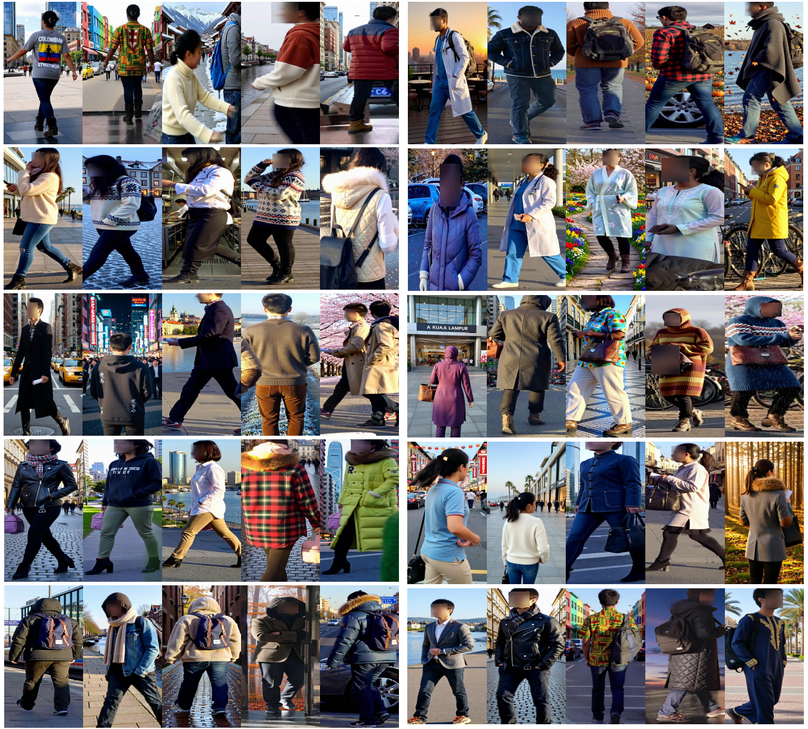

# CGCC: Towards Generalizable Clothes-Changing Person Re-Identification

ECCV 2026

## Introduction

This repository provides the dataset protocol and reference implementation for **CGCC: Towards Generalizable Clothes-Changing Person Re-Identification**. The project focuses on building a comprehensive benchmark for generalizable clothes-changing person re-identification, where models are expected to recognize the same identity across diverse clothes, environments, regions, seasons, weather conditions, and lighting.

The main contribution of this project is **CGCC**, a large-scale dataset with broad visual diversity and fine-grained semantic annotations. The accompanying TGIR training and evaluation code is provided as a reference baseline for learning robust identity representations on CGCC.

## CGCC Dataset

CGCC is designed for generalizable clothes-changing person re-identification. It contains diverse identity appearances generated under coupled variations of clothes, culture, region, season, weather, light, and scene context.

The dataset is available at [Hugging Face Datasets](https://huggingface.co/datasets/zhiTTime/cgcc).

The dataset contains:

| Item | Number |
| --- | ---: |
| Identities | 4,101 |
| Images | 217,248 |
| Cameras | 15 |
| Annotation types | ID, clothes, semantics |

Compared with conventional CC-ReID datasets that mainly focus on clothes changes, CGCC introduces richer open-world variations and structured semantic descriptions for each image. These annotations are organized into three disentangled fields: biometric traits, clothes, and environment.

## Dataset Examples



Each group shows the same identity under different generated conditions. The examples cover substantial changes in clothes, cultural context, region, season, weather, lighting, and background scene.

## Dataset Statistics

CGCC follows a disjoint train/test identity split:

| Split | IDs | Images |
| --- | ---: | ---: |
| Train | 1,041 | 59,404 |
| Query | 3,060 | 22,237 |
| Gallery | 3,060 | 135,607 |
| Total | 4,101 | 217,248 |

## Semantic Annotations

Each CGCC image is paired with structured semantic descriptions:

```text
1. Biometric
[A paragraph describing intrinsic physical attributes such as gender, estimated age, hair, body build, and facial features.]

2. Clothes
[A paragraph describing upper/lower wear, shoes, accessories, colors, and patterns.]

3. Environment
[A paragraph describing the scene, location, cultural context, lighting, objects, weather, time, and atmosphere.]
```

## Dataset Organization

Place the released CGCC dataset under `datasets/CGCC`:

```text
datasets/
  CGCC/
    train/
    test/
    list_train.txt
    list_val.txt
    list_query.txt
    list_gallery.txt
    text_descriptions/
      train_descriptions.json
      test_description.json
    EVA02-CLIP-bigE-14/
      train.npz
```

The default configuration expects:

```yaml
DATA:
  ROOT: "./datasets"
  CAPTION_DIR: "./datasets/CGCC"
  DATASET: "cgcc"
```

## Installation

Install the required packages:

```bash
pip install -r requirements.txt
```

## Data Preparation

Download CGCC from [Hugging Face Datasets](https://huggingface.co/datasets/zhiTTime/cgcc), place it under `datasets/CGCC`, and check the dataset paths in:

```text
configs/cgcc/eva02_l_tgir.yml
```

Make sure the image folders, split files, semantic annotation files, and extracted text/image features are available before training.

## Training and Evaluation

Train the reference model on CGCC:

```bash
CUDA_VISIBLE_DEVICES=0 python -m torch.distributed.launch \
  --nproc_per_node=1 \
  --master_port 1234 \
  train.py \
  --jobId 0 \
  --loss "ce,triplet,proto_itc,svd" \
  --config_file configs/cgcc/eva02_l_tgir.yml
```

